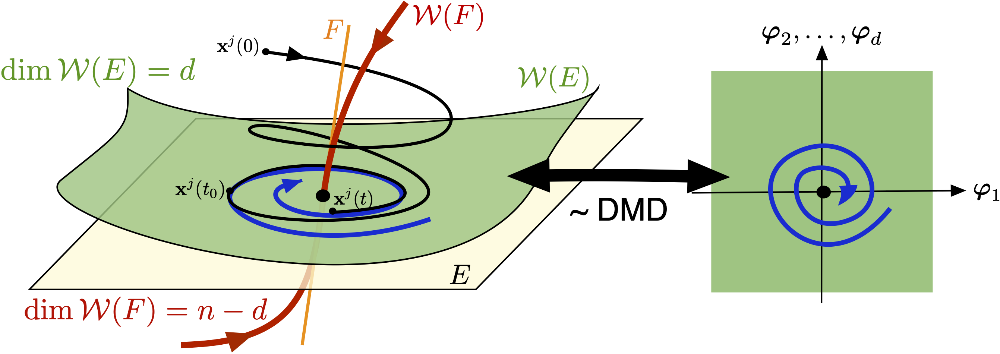
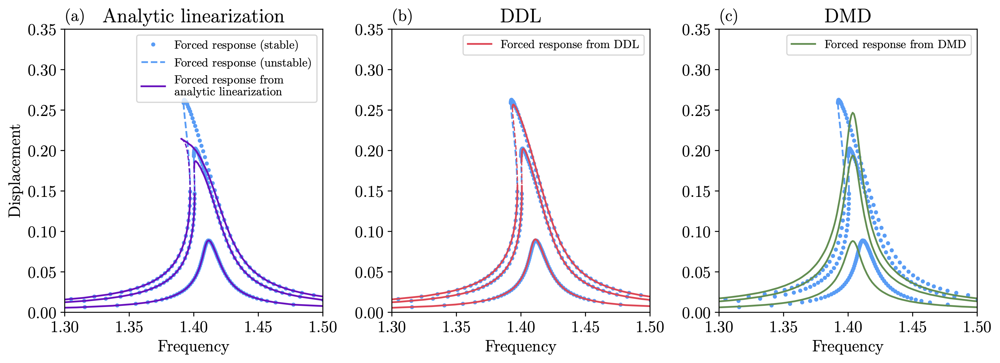

# Data-Driven Linearization (DDL)

Dynamic Mode Decomposition (DMD) and its variants, such as extended DMD (EDMD), are
broadly used to fit simple linear models to dynamical systems from observable data. A justification for DMD as a local, leading-order reduced model was given by Haller and Kaszás (2024) [1]. This was achieved by constructing linearizing transformations for the dynamics in attracting slow spectral submanifolds (SSMs), that have been defined by [2]. These attracting SSMs have been successfully used for nonlinear model reduction in data- and equation-driven settings by [3, 4, 5], most notably using the ```MATLAB``` package [SSMLearn](https://github.com/haller-group/SSMLearn).


The arguments of Haller and Kaszás (2024) [1] also lead to a new algorithm, data-driven
linearization (DDL), which is a higher-order linearization of the dynamics within slow SSMs. This package contains the numerical implementation of the algorithm using the ```Python``` libraries ```Numpy``` and ```Pytorch```. 


## Installation

DataDrivenLinearization depends on numpy, scipy, matplotlib, pytest, pytorch and jupyter (to run the example notebooks). Installation using pip is recommended.
After cloning the repository with the command 
```sh
git clone https://github.com/haller-group/DataDrivenLinearization.git
```

the package can be installed locally using ```pip``` by executing

```sh
cd DataDrivenLinearization
pip install -e . 
```
## Notation and mathematical setting

We assume that observations of trajectories of the dynamical system 
$$
\dot{\mathbf{x}} = \mathbf{f}(\mathbf{x}), \quad \mathbf{x}\in \mathbb{R}^n
$$
are recorded and that the system possesses a low-dimensional, attracting invariant (slow) manifold. 
Such manifolds are guaranteed to arise as slow spectral submanifolds (SSMs) at stable hyperbolic fixed points of the system, which is illustrated by the following figure. 



Denoting the parametrization of the $d$-dimensional slow SSM $\mathcal{W}(E)$ as $\boldsymbol{\varphi}=(\varphi_1, \varphi_2, ..., \varphi_d)$, the reduced dynamics can be written as 

$$
\dot{\boldsymbol{\varphi}} = \mathbf{B}\boldsymbol{\varphi} + \mathbf{q}(\boldsymbol{\varphi}).
$$

If the available data is sufficiently close to the slow SSM, DDL seeks a polynomial change of coordinates (to a variable denoted as $\boldsymbol{\gamma}$) of the form 

$$
\boldsymbol{\varphi} = \boldsymbol{\kappa}(\boldsymbol{\gamma}) = \boldsymbol{\gamma} + \sum_{|\mathbf{k}|=2}^{r} l_{\mathbf{k}}\boldsymbol{\gamma}^{\mathbf{k}}, \quad \boldsymbol{\gamma}^{\mathbf{k}}:=\gamma_1^{k_1}\gamma_2^{k_2}...\gamma_d^{k_d},
$$

such that the dynamics becomes linear, i.e.,

$$
\dot{\boldsymbol{\gamma}} = \mathbf{B}\boldsymbol{\gamma}.
$$

This transformation is obtained via regression _purely_ from observed data, without any knowledge of the underlying dynamical system. Therefore, DDL can be viewed as a higher-order refinement of linearization methods based on DMD. 

For more information see the manuscript [1], which can be found under ```docs/haller_kaszas2024.pdf```. 

## Features

The class DataDrivenLinearization contains the implementation of the DDL method. This class can be initialized by specifying the dimension of the slow SSM and the degree ($r$ in the formula above) up to which the transformation should be approximated. 

The transformation and the linear dynamics ($\mathbf{B}$ in the formula above) are computed by calling the ```.fit()``` method on trajectory data restricted to the SSM ($\boldsymbol{\varphi}$ in the formula above). 

Once the transformation and the linear dynamics are identified, the model can be used to predict unseen data, or to predict the response of the system to unseen, periodic excitation. 



## Example usage
The data should be organized as a _list of trajectories_, each having a shape of ```(n_dimensions, n_samples)```. 

```python
from data_driven_linearization.linearization import DataDrivenLinearization

model = DataDrivenLinearization(dimension=2, degree=3)
model.fit(training_data, # training_data is a list of np.arrays with shapes (2, n_samples)
           method = 'with_inverse',  method_optimization = 'trf', verbose = True)
```

Specifying ```method='with_inverse'``` allows DDL to fit the linearizing transformation and its inverse simultaneously. After fitting the model, we can extract these transformations to be used for further analysis as 

```python
from data_driven_linearization.differentiation_utils import differentiate_model_symbolic
inverse_transform, inverse_derivative, variables = differentiate_model_symbolic(model.poly, 
                                                                              model.inverse_transformation_model.coef_)

transform, derivative, variables = differentiate_model_symbolic(model.poly,
                                                                model.transformation_coefficients)
```

Further examples can be found in the ```examples/``` folder. 
## References 
Please consider citing the following paper, if you are using the code:

[1] G. Haller & B. Kaszás, Data-Driven Linearization of Dynamical Systems, to appear in Nonlinear Dynamics, (2024) [arXiv:2407.08177](https://arxiv.org/abs/2407.08177)

Additional references on the use of SSMs for nonlinear model reduction:

[2] G. Haller & S. Ponsioen, Exact model reduction by a slow-fast decomposition of nonlinear mechanical systems. Nonlinear Dynamics 90 (2017) 617-647

[3] M. Cenedese, J. Axås, B. Bäuerlein, K. Avila & G. Haller, Data-driven modeling and prediction of non-linearizable dynamics via spectral submanifolds Nat. Commun. 13 (2022) 872.

[4] J. Axås, M. Cenedese & G. Haller, Fast data-driven model reduction for nonlinear dynamical systems Nonlinear Dyn 111 (2023) 7941–7957.

[5] Z. Xu, B. Kaszás, M. Cenedese, G. Berti, F. Coletti, G. Haller, Data-driven modeling of the regular and chaotic dynamics of an inverted flag from experiments J. Fluid Mech. 987 (2024) R7. 


